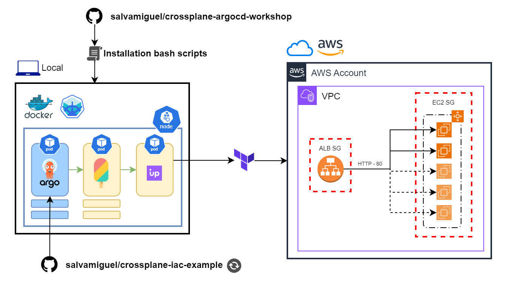

# Crossplane + ArgoCD Workshop
This repository is meant to be a Workshop on how to create a full GitOps workflow with Crossplane and ArgoCD for begginners. No experience with Docker or Kubernetes (k8s) is needed. 

## Table of Contents
- [Crossplane + ArgoCD Workshop](#crossplane--argocd-workshop)
  - [Table of Contents](#table-of-contents)
  - [Requisites](#requisites)
  - [Architecture](#architecture)
  - [Steps to install ArgoCD \& Crossplane](#steps-to-install-argocd--crossplane)
    - [Install ArgoCD](#install-argocd)
    - [Configure AWS Credentials](#configure-aws-credentials)
    - [Configuring my-app.yaml to point to one of the examples](#configuring-my-appyaml-to-point-to-one-of-the-examples)
    - [Creating a brand new ArgoCD app](#creating-a-brand-new-argocd-app)
- [Acknowledgement](#acknowledgement)

---

## Requisites
We assume that the following tools are already installed on your system:
- Docker
- Minkube
- Git
  
If you need help installing those please refer to the [REQUISITES.md](REQUISITES.md) file on this root folder.

You also will need an AWS Account (AWS_ACCESS_KEY_ID + AWS_SECRET_ACCESS_KEY) with permissions for the services you are willing to deploy. 


## Architecture
We are going to build a simple architecture to demostrate the power of GitOps. For demostration purposes, we will run our GitOps k8s cluster on your own local computer but this can also be deployed in the cloud.



On the local k8s cluster we will deploy ArgoCD that will manage Crossplane and Crossplane AWS providers (upbound). We will create a new ArgoCD application to track changes to an external git repository ([salvamiguel/crossplane-iac-example](https://github.com/salvamiguel/crossplane-iac-example)) were we will keep the Infrastructure definition in Chart deployments.

Changes in this repository will trigger ArgoCD action to apply new Infrastructure changes into AWS using Crossplane and upbound provider. Underthehood, Crossplane and upbound use Terraform to apply these changes in you AWS Account. 

## Steps to install ArgoCD & Crossplane
### Install ArgoCD
1. **Start Minikube cluster:**

    First we need to start the k8s cluster. This process is handled by minikube so we only need to start it.
   ```bash
   minikube --start
   ```
    This will create and configure base and required k8s pod for managing and creating other pods. 

2. **Clone this repository:**
   
    Download the contents of this repository to your local computer by clone it.
    ```bash
    git clone https://github.com/salvamiguel/crossplane-argocd-workshop
    ````
3. **Navigate to the new git repository folder:**
   ```bash
   cd crossplane-argocd-workshop
   ```
4. **Run installation scripts:**
    
    Let's readd execution permissions in case git removed those.
    ```bash
    chmod +x scripts/*.sh
    ```
    Now we can run the script ``01-init.sh`` that will install Helm if not installed already and add Helm Crossplane repositories.
    ```bash
    scripts/01-init.sh
    ```
    Then following script will apply deployment under the argocd/install folder, start the ArgoCD service then it will print the admin password and redirect port 8080 on your machine to port 80 on the ArgoCD pod. Keep the admin password in a safe place and change it ASAP.
    ```bash
    scripts/02-install-argocd.sh
    ```
### Configure AWS Credentials
5. **Open a new shell and create the AWS Credentials file:**

   ```bash
    scripts/03-create-aws-credentials-secret.sh
    ```
    This will create a new AWS config file named ``aws-creds.conf`` .
6. **Open `aws-creds.conf` and add your credentials**

    You need to update this file with your own AWS credentials.
    ```config
    [default]
    aws_access_key_id = <PASTE HERE YOUR ACCESS KEY ID>
    aws_secret_access_key = <PASTE HERE YOU SECRET ACCESS KEY>
    ```
7. **Create k8s AWS credentials secret by reruning the script:**
    
    Once the ``aws-creds.conf`` is created and filled, we will create a k8s secret for Crossplane provider by rerunning the same script.
   ```bash
    scripts/03-create-aws-credentials-secret.sh
    ```
### Install Crossplane
8. **Install Crossplane Chart:**
    
    Install Crossplane Helm repository and Crossplane Chart.
   ```bash
    scripts/04-install-crossplane-chart.sh 
    ```
### Create a new ArgoCD application

From here, you can deploy the ArgoCD application that will sync the state of the Git repository with your AWS infrastructure. You can leave the default one under `infrastructure/my-app.yaml`, use one of the examples or create a brand new one.

### Using the default my-app.yaml
If you want to deploy de default application you can run the following:
```bash
kubectl apply -f infrastructure/my-app.yaml
```
This will deploy the ArgoCD application defined in ``infrastructure/my-app.yaml`` which by default will point to the default infrastructure definition in [salvamiguel/crossplane-iac-example](https://github.com/salvamiguel/crossplane-iac-example) repository.

Default infrastructure includes a Application Load Balancer (ALB) that points to an Auto Scalling Group with several EC2 instances with a simple Apache HTTP service.
### Configuring my-app.yaml to point to one of the examples
In the [salvamiguel/crossplane-iac-example](https://github.com/salvamiguel/crossplane-iac-example) repository are several infrastructure examples built using Crossplane Charts under the ``infrastructure/examples`` folder. 

To use one of these examples edit the file from this repository ``infrastructure/my-app.yaml`` and change the ``path`` attribute to point to one of the examples.

```yaml
# infrastructure/my-app.yaml
spec:
  project: default
  source:
    repoURL: https://github.com/salvamiguel/crossplane-iac-example
    targetRevision: HEAD
    path: infrastructure/default
```

If you would like to try the s3 example just change the ``path`` to ``infrastructure/examples/s3`` like this:

```yaml
# infrastructure/my-app.yaml
spec:
  project: default
  source:
    repoURL: https://github.com/salvamiguel/crossplane-iac-example
    targetRevision: HEAD
    path: infrastructure/examples/s3
```

> [!WARNING] 
> Before changing the contents of ``infrastructure/my-app.yaml`` please make sure that the ArgoCD app is fully destroyed (if was created before) and the AWS infrastructure has terminated/deleted successfully. If not, you may destroy your ArgoCD app but not the infrastructure created and still incour in costs.
> To delete the ArgoCD app run: 
> ```bash
> kubectl delete -f infrastructure/my-app.yaml
> ```

Please see the documentation for other examples [here](https://github.com/salvamiguel/crossplane-iac-example/blob/main/README.md).

### Creating a brand new ArgoCD app

You can create a brand new ArgoCD app. You only need to duplicate the file ``infrastructure/my-app.yaml`` and change the ``repoURL``and ``path`` values to point to your own repository and folder path. 

> [!NOTE]
> Remember that files that define your architecture (``.yaml``) in your own repository should be under the path you provide and not in any subdirectory as ArgoCD will not pick them.


# Acknowledgement
This Workshop is based in my own work experience and the great work of:
- https://github.com/jonashackt/crossplane-argocd by @jonashackt
- https://www.codecentric.de/wissens-hub/blog/full-gitops-with-crossplane-and-argocd


